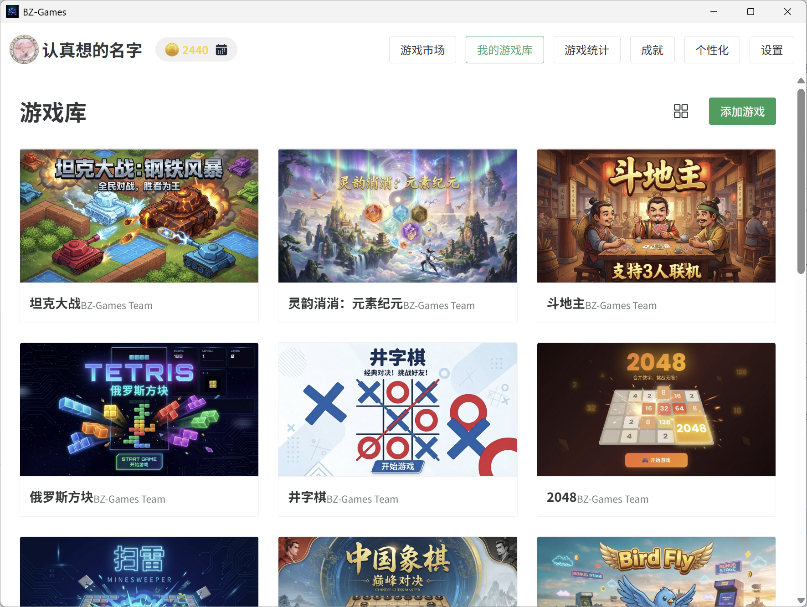
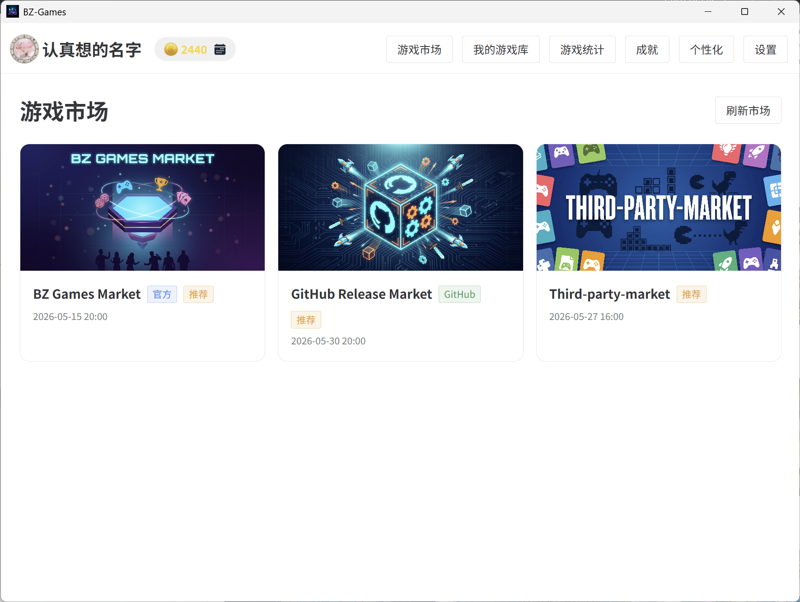
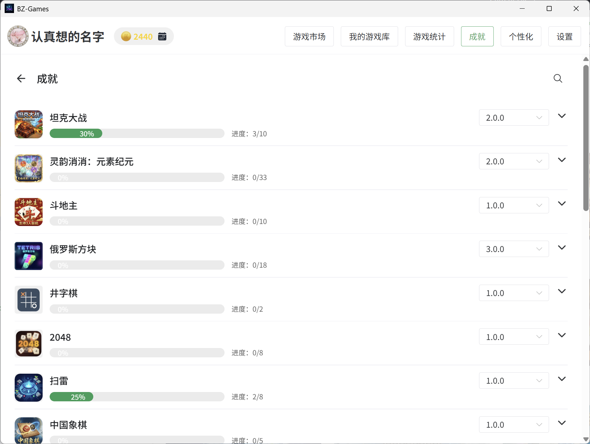
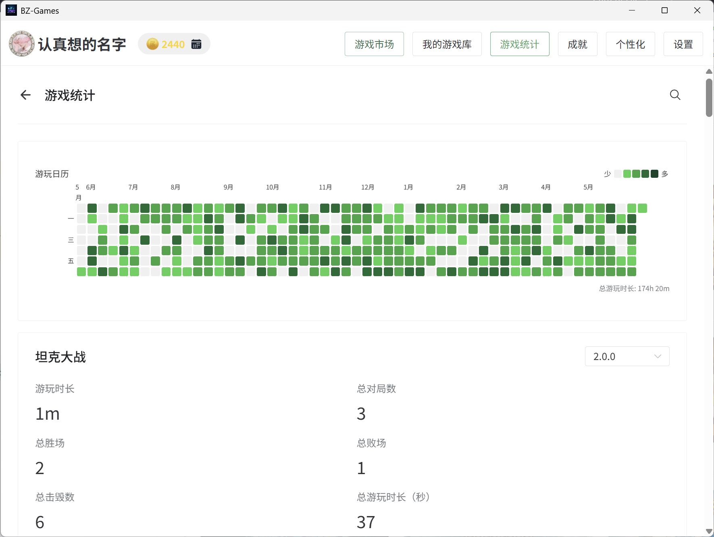
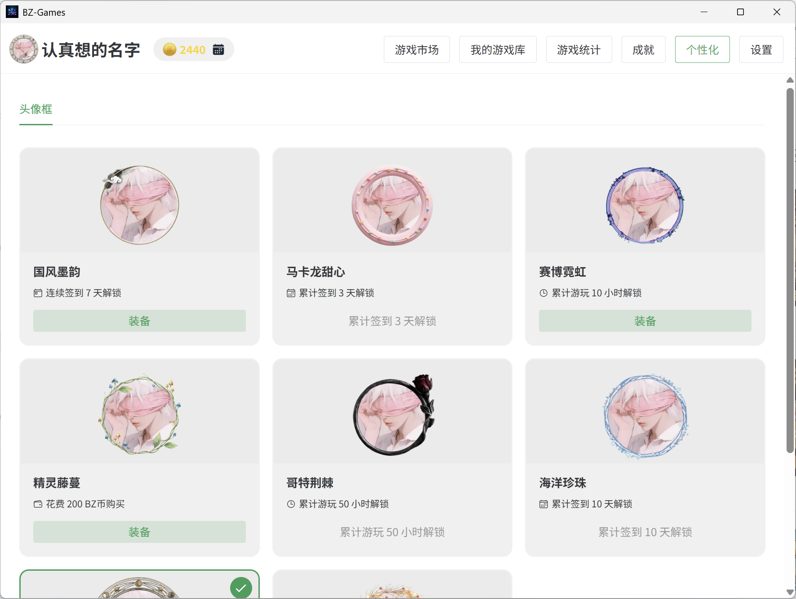
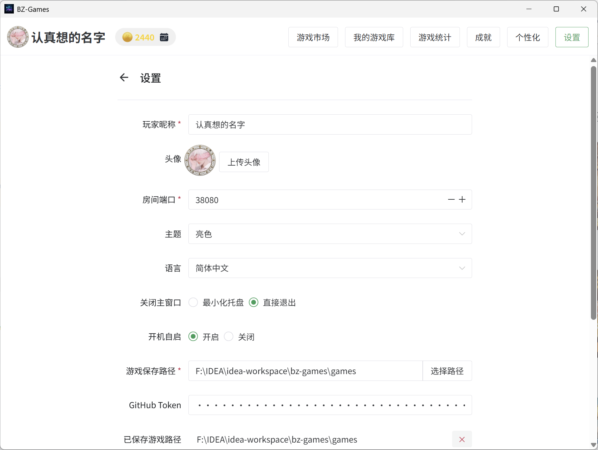

# BZ-Games ゲームプラットフォーム

[](https://www.electronjs.org/)
[](https://vuejs.org/)
[](https://www.typescriptlang.org/)

[简体中文](./README.md) | [English](./README.en.md) | 日本語 | [Deutsch](./README.de.md) | [繁體中文](./README.zh-TW.md) | [文言文](./README.lzh.md)

**BZ-Games** は、Windows 向けに設計された**ローカルファーストのゲームプラットフォーム**です。ユーザーはローカルゲームをインポートし、内蔵の P2P ルームシステムを通じて友人とマルチプレイを楽しめます。LAN 自動検出、自前の frp ダイレクト接続、公式リレーショートアドレスの 3 つのオンライン接続方式をサポートし、さらに GitHub OAuth ログインとクラウドデータ同期も提供します。

## ✨ 主な機能

- **📂 オープンゲームライブラリ**：仕様に準拠した任意のローカルゲームをインポート可能で、バージョンとファイルを自動管理します。
- **🔌 ローカルファーストデータ**：すべてのデータはローカルに暗号化保存され、クラウドアカウントは不要です。オプションで GitHub OAuth ログインによるクラウド同期が可能です。
- **🎮 統合オンラインロビー**：ルームシステム（作成/参加/準備完了/チャット/キック/再接続）を内蔵し、ゲームはローカル Game API に統合するだけで完全なマルチプレイ機能を利用できます。
- **🌐 マルチ接続方式**：LAN 自動検出、自前 frp 直結、公式リレーサーバーショートアドレスの 3 方式を状況に応じて切り替え可能。ルーム発見ページは物理 LAN / 仮想 LAN / サーバーの 3 タブで分類表示。
- **☁️ GitHub ログイン＆クラウド同期**：GitHub OAuth 認証によるログイン、`config.json` と `play_sessions.db` のクラウドアップロード/ダウンロード、進捗表示と SHA256 ハッシュ検証付き。
- **🏪 ゲームマーケット**：マルチソースのコミュニティゲームを閲覧・ダウンロード可能。ダウンロードタスクは進捗・一時停止・再開・キャンセル・フローティング通知に対応し、自動検証とインポートを行います。
- **🏆 実績・統計システム**：各ゲームで実績リストと統計データを定義可能。カレンダーヒートマップと戦績レポートにも対応。
- **🪙 経済システム**：毎日のチェックインで BZ コイン、累計プレイ時間で自動報酬。アバターフレームの解除・装備、ニックネームの色/フォント/エフェクトのパーソナライズ。
- **🚀 プロセス管理**：ゲームプロセスの起動/終了を自動化し、異常終了にも対応します。
- **🔄 バージョン管理**：同一ゲームの複数バージョンの共存と切り替えをサポートします。
- **🌍 国際化**：中国語（簡体・繁体）、英語、日本語、ドイツ語、漢文に対応。

## 📸 スクリーンショット

<p align="center">
  
  
</p>
<p align="center">
  
  
</p>
<p align="center">
  
  
</p>

## 🛠️ 技術スタック

- **Core**: Electron, TypeScript
- **Frontend**: Vue 3, Naive UI, Pinia, Vue Router
- **Build**: Electron-Vite, Electron-Builder
- **Storage**: electron-store (ローカル JSON)
- **Communication**: WebSocket (Room Server/Client), Electron IPC
- **Archive**: extract-zip (ZIP), 7zip-bin / 7za (7Z)
- **Update**: electron-updater (GitHub Releases)

## 🚀 クイックスタート

### 環境要件

- Node.js 18+
- pnpm 8+
- Windows 10/11 x64

### 依存関係のインストール

```bash
pnpm install
```

### 開発モード

開発サーバーを起動します（メインプロセスとレンダラープロセスのホットリロード付き）：

```bash
pnpm dev
```

### プロダクションビルド

Windows 用のインストーラーとポータブルパッケージをビルドします：

```bash
pnpm build:win
```

ビルド成果物は `dist` ディレクトリに生成されます。

## 📁 プロジェクト構成

```
bz-launcher/
├── games/                 # ゲームデータ保存ディレクトリ (ポータブルモード)
├── src/
│   ├── main/              # Electron メインプロセス (Node.js)
│   │   ├── services/      # コアビジネスロジック (GameManager, RoomServer など)
│   │   └── ipc/           # IPC 通信ハンドラー
│   ├── preload/           # Preload スクリプト (安全な API の公開)
│   ├── renderer/          # レンダラープロセス (Vue 3 UI)
│   └── shared/            # メイン・レンダラー共有の型定義
├── resources/             # アプリアイコンと静的リソース
└── electron.vite.config.ts
```

> マーケットインデックスデータは独立した [bz-games-market](https://github.com/baozha2023/bz-games-market) リポジトリで管理され、二層マーケットアーキテクチャで配信されます。

詳細については、`CLAUDE.md` の開発ガイドラインを参照してください。
