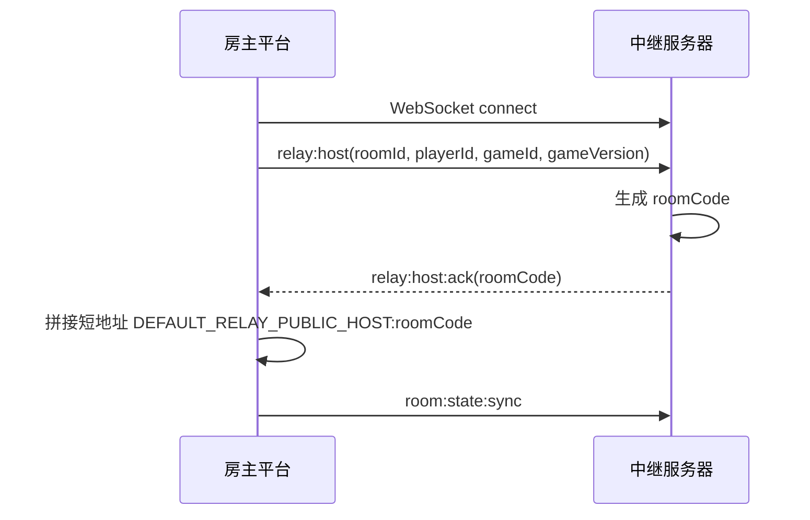
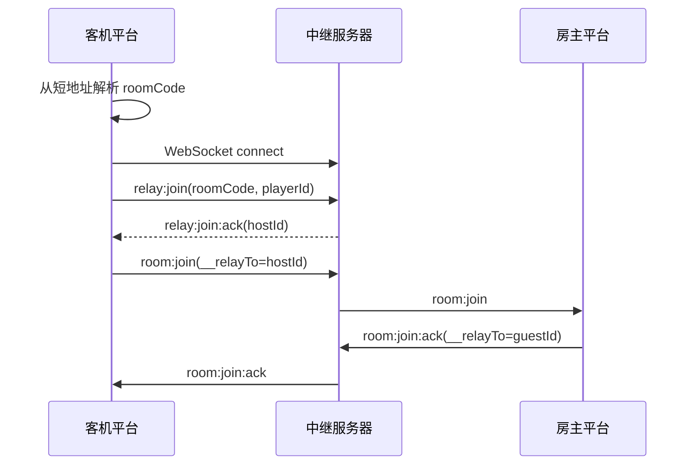
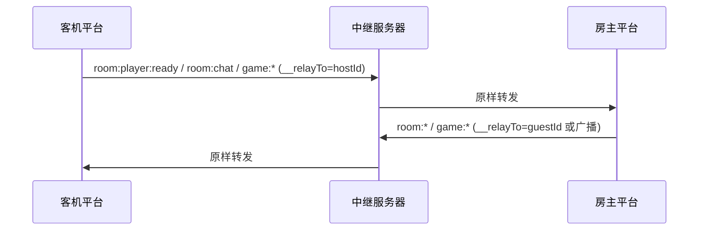

# BZ-Games 中继服务器接口文档

## 服务边界

BZ-Games 中继服务器提供 HTTP 查询接口和 WebSocket 中继接口，用于官方中继联机。

- 中继服务器生成、发送和识别 `roomCode`。
- 中继服务器使用 `roomId` 管理内部房间。
- 平台负责短地址拼接、展示、复制、输入和解析。
- 平台向中继服务器加入房间时只发送 `roomCode`。
- 中继服务器透明转发 RoomMessage、Game API v1 JSON 消息和 Game API v2 binary frame。

## 基础地址

默认监听端口：

```text
38090
```

默认本地地址：

```text
http://127.0.0.1:38090
ws://127.0.0.1:38090
```

平台侧生产配置由 `DEFAULT_RELAY_SERVER_URL` 指向中继服务器 HTTP/WebSocket 入口。

## 核心字段

| 字段 | 归属 | 示例 | 用途 |
| --- | --- | --- | --- |
| `roomId` | 平台生成，中继服务器内部管理 | `relay-8f6a...` | 房主注册房间时提交，用作中继服务器内部房间 Map key |
| `roomCode` | 中继服务器生成和识别 | `123456` | 房主注册成功后返回；客机加入时提交 |
| `playerId` | 平台玩家标识 | `player-xxx` | 标识房主或客机连接 |
| `hostId` | 房主玩家标识 | `player-host` | 客机收到 `relay:join:ack` 后用于上行路由 |
| `__relayTo` | 平台中继路由字段 | `player-host` | 指定中继转发目标 |

## HTTP 接口

### GET /health

返回服务器健康状态、当前容量和限制配置。

请求：

```http
GET /health HTTP/1.1
Host: 127.0.0.1:38090
```

响应：

```json
{
  "ok": true,
  "acceptingRooms": true,
  "roomCount": 1,
  "clientCount": 2,
  "eventLoopDelayMs": 0,
  "limits": {
    "maxRooms": 80,
    "maxClients": 400,
    "maxClientsPerRoom": 8,
    "maxEventLoopDelayMs": 250
  }
}
```

字段说明：

| 字段 | 类型 | 说明 |
| --- | --- | --- |
| `ok` | boolean | 服务进程可响应 HTTP 请求 |
| `acceptingRooms` | boolean | 当前是否允许创建新房间 |
| `roomCount` | number | 当前中继房间数 |
| `clientCount` | number | 当前已登记 WebSocket 客户端数 |
| `eventLoopDelayMs` | number | 当前事件循环延迟估算值 |
| `limits` | object | 当前容量限制 |

### GET /rooms

返回当前可发现的中继房间列表。

请求：

```http
GET /rooms HTTP/1.1
Host: 127.0.0.1:38090
```

响应：

```json
[
  {
    "id": "123456",
    "source": "relay",
    "roomCode": "123456",
    "name": "玩家 的房间",
    "gameId": "demo-game",
    "gameName": "Demo Game",
    "gameVersion": "1.0.0",
    "hostId": "player-host",
    "hostName": "玩家",
    "playerCount": 1,
    "maxPlayers": 4,
    "state": "waiting",
    "updatedAt": 1780557000000
  }
]
```

房间字段：

| 字段 | 类型 | 说明 |
| --- | --- | --- |
| `id` | string | 对外列表 ID，等于 `roomCode` |
| `source` | string | 固定为 `relay` |
| `roomCode` | string | 中继服务器生成的房间码 |
| `name` | string | 房间名称 |
| `gameId` | string | 游戏 ID |
| `gameName` | string | 游戏名称 |
| `gameVersion` | string | 游戏版本 |
| `hostId` | string | 房主玩家 ID |
| `hostName` | string | 房主昵称 |
| `playerCount` | number | 当前中继房间玩家数 |
| `maxPlayers` | number | 房间最大玩家数 |
| `state` | string | 房间状态 |
| `updatedAt` | number | 房间元信息更新时间戳 |

### OPTIONS /*

返回 `204`，用于跨域预检。

### 其它 HTTP 路径

返回：

```json
{
  "error": "not_found"
}
```

## WebSocket 接口

WebSocket 连接地址与 HTTP 服务使用同一入口。

```text
ws://127.0.0.1:38090
```

文本消息统一为 JSON：

```json
{
  "type": "relay:host",
  "payload": {}
}
```

二进制消息使用 BZ-Games v2 binary frame：

```text
4 字节 header 长度 + JSON header + binary body
```

### relay:host

房主注册中继房间。

请求：

```json
{
  "type": "relay:host",
  "payload": {
    "token": "bzgames",
    "roomId": "relay-8f6a",
    "playerId": "player-host",
    "gameId": "demo-game",
    "gameName": "Demo Game",
    "gameVersion": "1.0.0",
    "hostName": "玩家",
    "playerCount": 1,
    "maxPlayers": 4,
    "state": "waiting"
  }
}
```

必填字段：

| 字段 | 类型 | 说明 |
| --- | --- | --- |
| `roomId` | string | 平台生成的中继内部房间 ID |
| `playerId` | string | 房主玩家 ID |
| `gameId` | string | 游戏 ID |
| `gameVersion` | string | 游戏版本 |

可选字段：

| 字段 | 类型 | 说明 |
| --- | --- | --- |
| `token` | string | 启用 `RELAY_TOKEN` 时必填 |
| `gameName` | string | 游戏名称 |
| `hostName` | string | 房主昵称 |
| `playerCount` | number | 初始玩家数，默认 `1` |
| `maxPlayers` | number | 最大玩家数，默认 `4` |
| `state` | string | 房间状态，默认 `waiting` |

成功响应：

```json
{
  "type": "relay:host:ack",
  "payload": {
    "roomCode": "123456"
  }
}
```

### relay:join

客机通过房间码加入中继房间。

请求：

```json
{
  "type": "relay:join",
  "payload": {
    "token": "bzgames",
    "roomCode": "123456",
    "playerId": "player-guest"
  }
}
```

必填字段：

| 字段 | 类型 | 说明 |
| --- | --- | --- |
| `roomCode` | string | 中继服务器生成的房间码 |
| `playerId` | string | 客机玩家 ID |

可选字段：

| 字段 | 类型 | 说明 |
| --- | --- | --- |
| `token` | string | 启用 `RELAY_TOKEN` 时必填 |

成功响应：

```json
{
  "type": "relay:join:ack",
  "payload": {
    "hostId": "player-host"
  }
}
```

客机收到 `relay:join:ack` 后，向房主发送标准 `room:join` 消息，并通过 `__relayTo` 指向 `hostId`。

### relay:leave

当前 WebSocket 客户端离开中继房间。

请求：

```json
{
  "type": "relay:leave"
}
```

客机离开时，中继服务器向房主发送：

```json
{
  "type": "relay:peer:left",
  "payload": {
    "roomId": "relay-8f6a",
    "playerId": "player-guest"
  }
}
```

### relay:heartbeat

刷新当前客户端所属房间的活跃时间。

请求：

```json
{
  "type": "relay:heartbeat"
}
```

## 房间状态同步

房主发送标准 RoomMessage `room:state:sync` 时，中继服务器更新 `/rooms` 列表元信息。

请求：

```json
{
  "type": "room:state:sync",
  "payload": {
    "gameId": "demo-game",
    "gameName": "Demo Game",
    "gameVersion": "1.0.0",
    "hostId": "player-host",
    "maxPlayers": 4,
    "state": "waiting",
    "players": [
      {
        "id": "player-host",
        "name": "玩家"
      }
    ]
  }
}
```

更新字段：

| 字段 | 说明 |
| --- | --- |
| `gameId` | 更新游戏 ID |
| `gameName` | 更新游戏名称 |
| `gameVersion` | 更新游戏版本 |
| `hostId` | 更新房主玩家 ID |
| `maxPlayers` | 更新最大玩家数 |
| `state` | 更新房间状态 |
| `players` | 更新玩家数量，并从房主玩家记录更新 `hostName` 和 `name` |

## 透明转发规则

### 文本消息

除 `relay:*` 控制信令和房主侧 `room:state:sync` / `room:disbanded` 控制处理外，其它文本 JSON 消息按路由规则原样转发。

支持的目标字段优先级：

```text
__relayTo -> relayTo -> to -> targetPlayerId -> payload.__relayTo
```

### 二进制消息

中继服务器解析 binary frame 的 JSON header，并按 header 中的目标字段转发完整原始二进制帧。

### 路由规则

| 发送方 | 目标字段 | 转发结果 |
| --- | --- | --- |
| 客机 | 必须等于房主 `hostId` | 转发给房主 |
| 客机 | 缺失或不是房主 `hostId` | 不转发 |
| 房主 | 指定当前房间成员 | 转发给指定成员 |
| 房主 | 不指定目标 | 广播给除房主外的当前房间成员 |
| 房主 | 指定非当前房间成员 | 不转发 |

## 房间关闭与连接清理

中继服务器在以下场景关闭房间并向房间内客户端发送 `relay:closed`：

- 房主 WebSocket 断开。
- 房间成员数变为 `0`。
- 房主发送 `room:disbanded`。
- 房间超过 `ROOM_TTL_MS` 未更新。
- 客机加入时发现房主连接不存在。

房主发送 `room:kicked` 或 `room:join:refused` 时，中继服务器根据目标字段移除对应客机连接。

## 错误消息

错误统一通过 WebSocket 文本消息返回：

```json
{
  "type": "relay:error",
  "payload": {
    "code": "room_not_found"
  }
}
```

错误码：

| code | 场景 |
| --- | --- |
| `unauthorized` | 配置了 `RELAY_TOKEN`，请求 token 不匹配 |
| `invalid_host_payload` | `relay:host` 缺少必填字段或类型不正确 |
| `invalid_join_payload` | `relay:join` 缺少 `roomCode` / `playerId` 或类型不正确 |
| `room_not_found` | `roomCode` 不存在或房主连接不存在 |
| `own_room` | 玩家尝试加入自己的房间 |
| `game_started` | 房间状态不是 `waiting` |
| `capacity_full` | 服务容量、房间容量或事件循环延迟达到限制 |

`capacity_full` 可携带 `reason`：

| reason | 场景 |
| --- | --- |
| `max_rooms` | 达到最大房间数 |
| `max_clients` | 达到最大客户端数 |
| `room_full` | 房间达到中继连接容量 |
| `server_busy` | 事件循环延迟达到阈值 |

## 环境变量

| 变量 | 默认值 | 说明 |
| --- | --- | --- |
| `PORT` | `38090` | HTTP/WebSocket 监听端口 |
| `ROOM_TTL_MS` | `60000` | 房间活跃超时时间 |
| `HEARTBEAT_INTERVAL_MS` | `30000` | WebSocket ping 与清理间隔 |
| `MAX_TEXT_BYTES` | `1048576` | 单条文本消息最大字节数 |
| `MAX_BINARY_BYTES` | `12582912` | 单条二进制消息最大字节数 |
| `RELAY_TOKEN` | 空字符串 | 房主注册和客机加入鉴权 token；空字符串表示不校验 |
| `MAX_ROOMS` | `80` | 最大同时房间数 |
| `MAX_CLIENTS` | `400` | 最大已登记客户端数 |
| `MAX_CLIENTS_PER_ROOM` | `8` | 单房间最大中继客户端数上限 |
| `MAX_EVENT_LOOP_DELAY_MS` | `250` | 事件循环延迟限制 |

## 典型流程

### 房主开房



### 客机加入



### 准备、聊天和游戏消息


