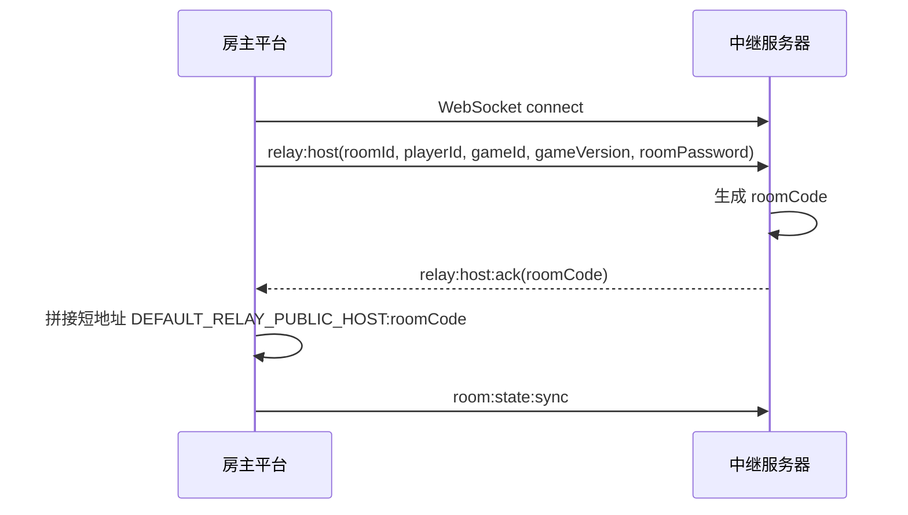
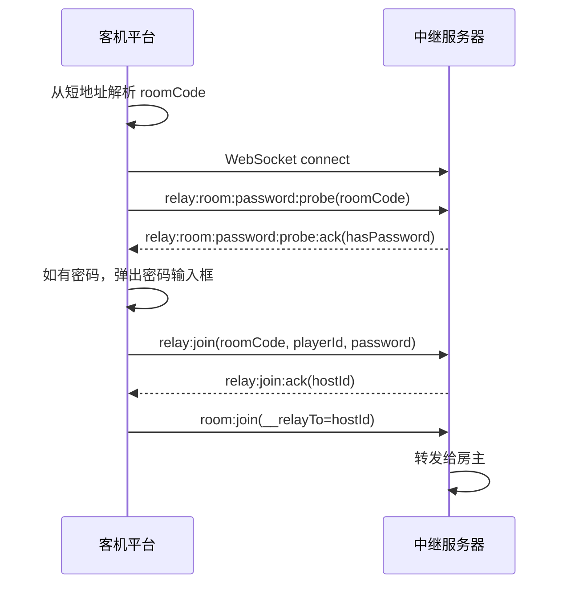
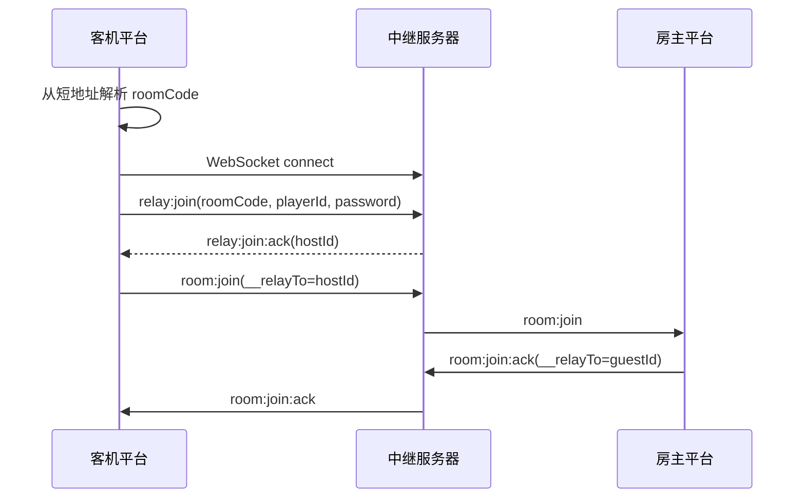
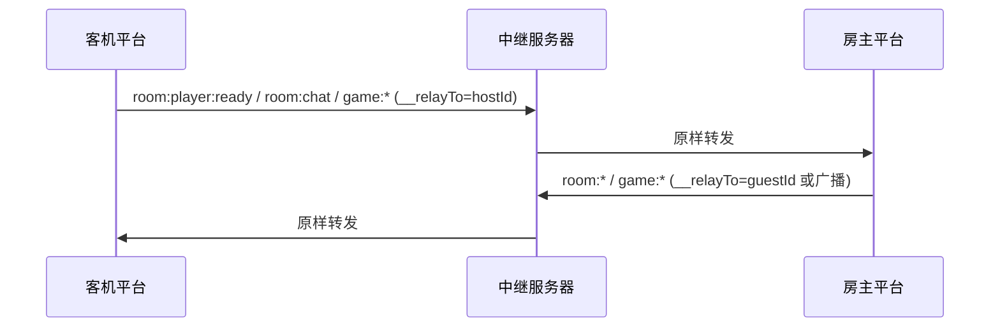

# BZ-Games 中继服务器接口文档

## 服务边界

BZ-Games 官方服务端提供中继联机、GitHub OAuth 登录和云端数据同步三大能力。

- 中继服务器生成、发送和识别 `roomCode`。
- 中继服务器使用 `roomId` 管理内部房间。
- 平台负责短地址拼接、展示、复制、输入和解析。
- 平台向中继服务器加入房间时只发送 `roomCode`。
- 中继服务器透明转发 RoomMessage、Game API v1 JSON 消息和 Game API v2 binary frame。
- 登录与云同步服务依赖 MySQL + MongoDB，用于用户身份认证，以及脱敏加密配置与业务 SQL dump 组成的单一平台快照同步。

## 基础地址

Relay 默认内部监听端口：

```text
38091
```

默认本地地址：

```text
http://127.0.0.1:38091
ws://127.0.0.1:38091
```

平台侧生产配置由 `DEFAULT_RELAY_SERVER_URL` 指向公网 Nginx HTTP 入口，例如
`http://relay.example.com:38090`；WebSocket 客户端必须连接同一公网入口的 `/ws/` 路径：
`ws://relay.example.com:38090/ws/`。只有服务器本机调试或 Nginx 反向代理目标允许直接使用
`127.0.0.1:38091`，该端口不得暴露到公网。

## 核心字段

| 字段        | 归属                         | 示例            | 用途                                               |
| ----------- | ---------------------------- | --------------- | -------------------------------------------------- |
| `roomId`    | 平台生成，中继服务器内部管理 | `relay-8f6a...` | 房主注册房间时提交，用作中继服务器内部房间 Map key |
| `roomCode`  | 中继服务器生成和识别         | `123456`        | 房主注册成功后返回；客机加入时提交                 |
| `playerId`  | 平台玩家标识                 | `player-xxx`    | 标识房主或客机连接                                 |
| `hostId`    | 房主玩家标识                 | `player-host`   | 客机收到 `relay:join:ack` 后用于上行路由           |
| `__relayTo` | 平台中继路由字段             | `player-host`   | 指定中继转发目标                                   |

## HTTP 接口

除 GitHub OAuth 登录入口与回调外，HTTP 接口都必须携带平台构建时注入的 relayToken。推荐使用 `X-Relay-Token: <relayToken>` Header。

### GET /health

返回服务器健康状态、当前容量和限制配置。

请求：

```http
GET /health HTTP/1.1
Host: 127.0.0.1:38091
X-Relay-Token: <relayToken>
```

响应：

```json
{
  "ok": true,
  "acceptingRooms": true,
  "roomCount": 1,
  "clientCount": 2,
  "eventLoopDelayMs": 0,
  "limits": {
    "maxRooms": 80,
    "maxClients": 400,
    "maxClientsPerRoom": 10,
    "maxEventLoopDelayMs": 250
  }
}
```

字段说明：

| 字段               | 类型    | 说明                          |
| ------------------ | ------- | ----------------------------- |
| `ok`               | boolean | 服务进程可响应 HTTP 请求      |
| `acceptingRooms`   | boolean | 当前是否允许创建新房间        |
| `roomCount`        | number  | 当前中继房间数                |
| `clientCount`      | number  | 当前已登记 WebSocket 客户端数 |
| `eventLoopDelayMs` | number  | 当前事件循环延迟估算值        |
| `limits`           | object  | 当前容量限制                  |

### GET /rooms

返回当前可发现的中继房间列表。

请求：

```http
GET /rooms HTTP/1.1
Host: 127.0.0.1:38091
X-Relay-Token: <relayToken>
```

响应：

```json
[
  {
    "id": "123456",
    "source": "relay",
    "roomCode": "123456",
    "name": "玩家 的房间",
    "gameId": "demo-game",
    "gameName": "Demo Game",
    "gameVersion": "1.0.0",
    "hostId": "player-host",
    "hostName": "玩家",
    "playerCount": 1,
    "maxPlayers": 4,
    "state": "waiting",
    "updatedAt": 1780557000000
  }
]
```

房间字段：

| 字段          | 类型   | 说明                         |
| ------------- | ------ | ---------------------------- |
| `id`          | string | 对外列表 ID，等于 `roomCode` |
| `source`      | string | 固定为 `relay`               |
| `roomCode`    | string | 中继服务器生成的房间码       |
| `name`        | string | 房间名称                     |
| `gameId`      | string | 游戏 ID                      |
| `gameName`    | string | 游戏名称                     |
| `gameVersion` | string | 游戏版本                     |
| `hostId`      | string | 房主玩家 ID                  |
| `hostName`    | string | 房主昵称                     |
| `playerCount` | number | 当前中继房间玩家数           |
| `maxPlayers`  | number | 房间最大玩家数               |
| `state`       | string | 房间状态                     |
| `updatedAt`   | number | 房间元信息更新时间戳         |

### OPTIONS /\*

返回 `204`，用于跨域预检。

---

## GitHub OAuth 登录

登录服务需要 MySQL 已配置且 `GITHUB_CLIENT_ID`、`GITHUB_CLIENT_SECRET`、`GITHUB_CALLBACK_URL` 全部设置后才启用。未配置时返回 `503`。

认证方式：登录成功后返回的 `session_token` 通过以下任一方式传递：

- HTTP Header: `Authorization: Bearer <token>`
- Cookie: `bz_games_session=<token>`

桌面端登录时，平台会打开 `/auth/github/start?returnTo=bzgames://oauth-complete`。GitHub 回调服务端后，服务端再跳转到 `bzgames://oauth-complete#session_token=...&expires_at=...&login=...`，Electron 主进程接收自定义协议并保存云同步会话。

### GET /auth/github/start

发起 GitHub OAuth 授权流程。

请求：

```http
GET /auth/github/start?returnTo=bzgames%3A%2F%2Foauth-complete HTTP/1.1
Host: 127.0.0.1:38091
```

查询参数：

| 参数       | 类型   | 必填 | 说明                                                                                                                      |
| ---------- | ------ | ---- | ------------------------------------------------------------------------------------------------------------------------- |
| `returnTo` | string | 否   | 登录成功后的回跳 URL，仅允许配置的 Portal `/admin/` 路径、`bzgames://`、带端口的 `http://127.0.0.1` 或 `http://localhost` |

响应：`302` 跳转到 `https://github.com/login/oauth/authorize`，携带 `client_id`、`redirect_uri`、`scope`、`state`。

### GET /auth/github/callback

GitHub 回调端点，由 GitHub 在用户授权后跳转。最终用户会看到登录成功页面，浏览器写入 Session Cookie。

请求：

```http
GET /auth/github/callback?code=<authorization_code>&state=<state_token> HTTP/1.1
```

响应（成功）：

- 未传 `returnTo`：`200` HTML 登录成功页面，并写入 Session Cookie。
- 传入合法客户端 `returnTo`：`302` 跳转到该地址，URL hash 中携带 `session_token`、`expires_at`、`login`，同时写入 Session Cookie。
- 传入合法 Portal `returnTo`：只写入 Session Cookie 并同源跳转，不在 URL 中暴露 Session Token。

响应（失败）：

| 状态码 | error                          | 说明                           |
| ------ | ------------------------------ | ------------------------------ |
| `400`  | `invalid_oauth_callback`       | 缺少 `code` 或 `state`         |
| `400`  | `invalid_oauth_state`          | state 无效或已过期             |
| `502`  | `github_token_exchange_failed` | 用 code 换取 access token 失败 |

### GET /api/portal/v1/session

获取 Web 管理端当前会话及由服务端计算的 capability。接口只接受 Session Cookie，携带 Bearer Token 时拒绝。

请求：

```http
GET /api/portal/v1/session HTTP/1.1
Cookie: bz_games_session=<session_token>
```

响应（成功）：

```json
{
  "user": {
    "id": "1",
    "githubId": "12345678",
    "login": "player",
    "name": "Player Name",
    "nickname": "玩家",
    "avatarUrl": "https://avatars.githubusercontent.com/u/12345678?v=4",
    "profileUrl": "https://github.com/player",
    "email": "player@example.com",
    "role": "player",
    "createdAt": "2026-06-11T12:00:00.000Z",
    "updatedAt": "2026-06-11T12:00:00.000Z",
    "lastLoginAt": "2026-06-11T12:00:00.000Z"
  },
  "capabilities": [],
  "expiresAt": "2026-07-11T12:00:00.000Z"
}
```

响应（失败）：

| 状态码 | error                 | 说明                    |
| ------ | --------------------- | ----------------------- |
| `401`  | `unauthorized`        | 未登录或 session 已过期 |
| `503`  | `auth_not_configured` | MySQL 未配置            |

### POST /api/auth/logout

退出登录，删除服务端 session。

请求：

```http
POST /api/auth/logout HTTP/1.1
Cookie: bz_games_session=<session_token>
Origin: https://relay.example.com
```

响应：`200`

```json
{
  "ok": true
}
```

接口只接受管理端 Cookie 并校验精确 Origin；桌面客户端 Bearer 会话的退出请使用
`DELETE /api/v1/me/session`。

### DELETE /api/v1/me/session

吊销当前桌面客户端的 Bearer 会话（客户端"退出登录"使用）。接口只接受客户端
Bearer Session 和 `X-Relay-Token`，不接受 Cookie，会话身份从当前 Session 解析；
成功后该 Session Token 立即失效。

请求：

```http
DELETE /api/v1/me/session HTTP/1.1
Authorization: Bearer <session_token>
X-Relay-Token: <relayToken>
```

响应：`200`

```json
{
  "ok": true
}
```

| 状态码 | error                                 | 说明                                           |
| ------ | ------------------------------------- | ---------------------------------------------- |
| 401    | `unauthorized`                        | 缺少 `X-Relay-Token` 或缺少 Bearer Session     |
| 401    | `session_expired` / `session_invalid` | 会话已过期或已失效（此时客户端应清除本地会话） |
| 503    | `auth_not_configured`                 | 服务器未启用用户存储                           |

### PATCH /api/v1/me/profile

更新当前桌面客户端登录用户的昵称。接口只接受客户端 Bearer Session，不接受 Cookie，
用户身份从当前 Session 解析，不接受请求体中的用户 ID。

请求：

```http
PATCH /api/v1/me/profile HTTP/1.1
Authorization: Bearer <session_token>
Content-Type: application/json
X-Relay-Token: <relayToken>

{"nickname":"新的昵称"}
```

昵称必须非空、最多 16 个字符，并且不能包含 `< > " ' \` & /`。

响应：

```json
{
  "ok": true,
  "user": {
    "id": "1",
    "nickname": "新的昵称"
  }
}
```

未登录或会话失效返回 `401`；昵称格式错误返回 `400`。

### PUT /api/v1/me/presence

更新当前桌面客户端的在线状态。接口只接受客户端 Bearer Session 和
`X-Relay-Token`，用户身份从当前 Session 解析，不接受请求体中的用户 ID。

请求：

```http
PUT /api/v1/me/presence HTTP/1.1
Authorization: Bearer <session_token>
Content-Type: application/json
X-Relay-Token: <relayToken>

{"online":true}
```

请求体必须只包含布尔字段 `online`。客户端开启后每 60 秒发送一次心跳；服务端超过
90 秒未收到心跳时将用户视为离线，并由后台清理任务回收过期标记。

响应：

```json
{
  "ok": true,
  "presence": {
    "isOnline": true,
    "lastOnlineAt": "2026-08-22T12:00:00.000Z"
  }
}
```

未登录或会话失效返回 `401`；请求体错误返回 `400`。

---

## Cloud Snapshot v2（BZ-Games 4.0）

Cloud Snapshot v2 is the only cloud data protocol. The server does not register earlier snapshot or file routes.

Authenticated HTTP endpoints use the following `401` response codes. Each response also includes a human-readable `message`:

- `unauthorized`: no GitHub session token was supplied.
- `session_expired`: the supplied GitHub session has expired.
- `session_invalid`: the supplied token is invalid, revoked, or unknown.

`PlatformCloudSnapshot` contains exactly `formatVersion: 2`, `dataModelVersion: 4`, `createdAt`, encrypted/sanitized `config`, and `databaseSql`. The dump contains only `play_sessions`, `achievement_unlocks`, and `stats_reports`; games, versions, libraries and files are excluded.

### GET /api/v2/cloud/platform-snapshot/meta

Returns `{ snapshot: { version, size, sha256, contentType, updatedAt } }`. Returns `404 snapshot_not_found` when the user has no snapshot.

### GET /api/v2/cloud/platform-snapshot

Downloads exactly one current snapshot. Response headers include `content-length`, `etag`, `x-file-sha256`, and `cache-control: no-store`.

### PUT /api/v2/cloud/platform-snapshot

Uploads one complete JSON snapshot. `Content-Length` is required and cannot exceed `MAX_PLATFORM_CLOUD_SNAPSHOT_BYTES` (128 MiB by default).

The server finishes the GridFS upload first, validates the stored object with a constant-memory streaming parser, then atomically switches `user_platform_snapshots` and commits the successful-upload rate limit inside one MySQL transaction. A validation or transaction failure deletes the new object, releases the temporary rate-limit reservation, and preserves the old pointer. After a successful switch, the old object is deleted after `PLATFORM_SNAPSHOT_GC_GRACE_MS`.

Successful response: `{ ok: true, snapshot: { version, size, sha256, contentType, updatedAt } }`.

Successful upload and download operations are independently limited to once per GitHub account per 24 hours. Failed validation, storage, pointer publication, and interrupted downloads release their reservation and do not consume the 24-hour cooldown. While `CLOUD_V2_MAINTENANCE=true`, all v2 endpoints return `503 cloud_v2_maintenance`. Other common errors are `401 unauthorized`, `401 session_expired`, `401 session_invalid`, `404 snapshot_not_found`, `413 snapshot_too_large`, `429 cloud_sync_rate_limited`, `500 cloud_upload_failed`, `500 cloud_download_failed`, `503 cloud_rate_limit_unavailable`, and `503 cloud_not_configured`.

## WebSocket 接口

WebSocket 公网连接地址与 HTTP 服务使用同一 Nginx 入口，但必须使用 `/ws/` 路径；本机直连
Relay 时才使用内部端口。

```text
公网：ws://relay.example.com:38090/ws/
本机：ws://127.0.0.1:38091
```

文本消息统一为 JSON：

```json
{
  "type": "relay:host",
  "payload": {}
}
```

二进制消息使用 BZ-Games v2 binary frame：

```text
4 字节 header 长度 + JSON header + binary body
```

### relay:host

房主注册中继房间。

请求：

```json
{
  "type": "relay:host",
  "payload": {
    "token": "your-relay-token",
    "roomId": "relay-8f6a",
    "playerId": "player-host",
    "gameId": "demo-game",
    "gameName": "Demo Game",
    "gameVersion": "1.0.0",
    "hostName": "玩家",
    "roomPassword": "123456",
    "playerCount": 1,
    "maxPlayers": 4,
    "state": "waiting"
  }
}
```

必填字段：

| 字段          | 类型   | 说明                      |
| ------------- | ------ | ------------------------- |
| `roomId`      | string | 平台生成的中继内部房间 ID |
| `playerId`    | string | 房主玩家 ID               |
| `gameId`      | string | 游戏 ID                   |
| `gameVersion` | string | 游戏版本                  |

可选字段：

| 字段           | 类型   | 说明                                     |
| -------------- | ------ | ---------------------------------------- |
| `token`        | string | 启用 `RELAY_TOKEN` 时必填                |
| `gameName`     | string | 游戏名称                                 |
| `hostName`     | string | 房主昵称                                 |
| `roomPassword` | string | 房间密码，设置后 `hasPassword` 为 `true` |
| `playerCount`  | number | 初始玩家数，默认 `1`                     |
| `maxPlayers`   | number | 最大玩家数，默认 `4`                     |
| `state`        | string | 房间状态，默认 `waiting`                 |

成功响应：

```json
{
  "type": "relay:host:ack",
  "payload": {
    "roomCode": "123456"
  }
}
```

### relay:join

客机通过房间码加入中继房间。

请求：

```json
{
  "type": "relay:join",
  "payload": {
    "token": "your-relay-token",
    "roomCode": "123456",
    "playerId": "player-guest",
    "password": "123456"
  }
}
```

必填字段：

| 字段       | 类型   | 说明                   |
| ---------- | ------ | ---------------------- |
| `roomCode` | string | 中继服务器生成的房间码 |
| `playerId` | string | 客机玩家 ID            |

可选字段：

| 字段       | 类型   | 说明                           |
| ---------- | ------ | ------------------------------ |
| `token`    | string | 启用 `RELAY_TOKEN` 时必填      |
| `password` | string | 房间密码，有密码的房间必须提供 |

成功响应：

```json
{
  "type": "relay:join:ack",
  "payload": {
    "hostId": "player-host"
  }
}
```

客机收到 `relay:join:ack` 后，向房主发送标准 `room:join` 消息，并通过 `__relayTo` 指向 `hostId`。

### relay:leave

当前 WebSocket 客户端离开中继房间。

请求：

```json
{
  "type": "relay:leave"
}
```

客机离开时，中继服务器向房主发送：

```json
{
  "type": "relay:peer:left",
  "payload": {
    "roomId": "relay-8f6a",
    "playerId": "player-guest"
  }
}
```

### relay:heartbeat

刷新当前客户端所属房间的活跃时间。

请求：

```json
{
  "type": "relay:heartbeat"
}
```

### relay:room:password:probe

探测房间是否有密码（不验证密码是否正确）。此消息无需先加入房间即可发送。

请求：

```json
{
  "type": "relay:room:password:probe",
  "payload": {
    "token": "your-relay-token",
    "roomCode": "123456"
  }
}
```

必填字段：

| 字段       | 类型   | 说明                   |
| ---------- | ------ | ---------------------- |
| `roomCode` | string | 中继服务器生成的房间码 |

响应：

```json
{
  "type": "relay:room:password:probe:ack",
  "payload": {
    "hasPassword": true,
    "hostId": "房主 playerId"
  }
}
```

`hasPassword` 为 `false` 时可直接加入，为 `true` 时需要提供 `password` 字段。`hostId` 用于客户端判断目标房间是否为本地正在主持的房间。

房间不存在时返回 `relay:error`（`room_not_found`）。

### relay:room:password:update

房主在中途修改房间密码（仅房主有效）。

请求：

```json
{
  "type": "relay:room:password:update",
  "payload": {
    "roomPassword": "newpassword"
  }
}
```

消息不会被转发给房间内其他客户端，仅更新中继服务器侧房间状态。

## 房间状态同步

房主发送标准 RoomMessage `room:state:sync` 时，中继服务器更新 `/rooms` 列表元信息。

请求：

```json
{
  "type": "room:state:sync",
  "payload": {
    "gameId": "demo-game",
    "gameName": "Demo Game",
    "gameVersion": "1.0.0",
    "hostId": "player-host",
    "maxPlayers": 4,
    "state": "waiting",
    "players": [
      {
        "id": "player-host",
        "name": "玩家"
      }
    ]
  }
}
```

更新字段：

| 字段          | 说明                                                    |
| ------------- | ------------------------------------------------------- |
| `gameId`      | 更新游戏 ID                                             |
| `gameName`    | 更新游戏名称                                            |
| `gameVersion` | 更新游戏版本                                            |
| `hostId`      | 更新房主玩家 ID                                         |
| `maxPlayers`  | 更新最大玩家数                                          |
| `state`       | 更新房间状态                                            |
| `players`     | 更新玩家数量，并从房主玩家记录更新 `hostName` 和 `name` |

## 透明转发规则

### 文本消息

除 `relay:*` 控制信令和房主侧 `room:state:sync` / `room:disbanded` 控制处理外，其它文本 JSON 消息按路由规则原样转发。

支持的目标字段优先级：

```text
__relayTo -> relayTo -> to -> targetPlayerId -> payload.__relayTo
```

### 二进制消息

中继服务器解析 binary frame 的 JSON header，并按 header 中的目标字段转发完整原始二进制帧。

### 路由规则

| 发送方 | 目标字段                | 转发结果                     |
| ------ | ----------------------- | ---------------------------- |
| 客机   | 必须等于房主 `hostId`   | 转发给房主                   |
| 客机   | 缺失或不是房主 `hostId` | 不转发                       |
| 房主   | 指定当前房间成员        | 转发给指定成员               |
| 房主   | 不指定目标              | 广播给除房主外的当前房间成员 |
| 房主   | 指定非当前房间成员      | 不转发                       |

## 房间关闭与连接清理

中继服务器在以下场景关闭房间并向房间内客户端发送 `relay:closed`：

- 房主 WebSocket 断开。
- 房间成员数变为 `0`。
- 房主发送 `room:disbanded`。
- 房间超过 `ROOM_TTL_MS` 未更新。
- 客机加入时发现房主连接不存在。

房主发送 `room:kicked` 或 `room:join:refused` 时，中继服务器根据目标字段移除对应客机连接。

## 错误消息

错误统一通过 WebSocket 文本消息返回：

```json
{
  "type": "relay:error",
  "payload": {
    "code": "room_not_found"
  }
}
```

错误码：

| code                   | 场景                                                                                  |
| ---------------------- | ------------------------------------------------------------------------------------- |
| `unauthorized`         | 配置了 `RELAY_TOKEN`，请求 token 不匹配                                               |
| `invalid_host_payload` | `relay:host` 缺少必填字段或类型不正确                                                 |
| `invalid_join_payload` | `relay:join` 或 `relay:room:password:probe` 缺少 `roomCode` / `playerId` 或类型不正确 |
| `room_not_found`       | `roomCode` 不存在或房主连接不存在                                                     |
| `own_room`             | 玩家尝试加入自己的房间                                                                |
| `game_started`         | 房间状态不是 `waiting`                                                                |
| `password_required`    | 有密码的房间未提供 `password`                                                         |
| `password_incorrect`   | 提供的密码不匹配                                                                      |
| `capacity_full`        | 服务容量、房间容量或事件循环延迟达到限制                                              |

`capacity_full` 可携带 `reason`：

| reason        | 场景                 |
| ------------- | -------------------- |
| `max_rooms`   | 达到最大房间数       |
| `max_clients` | 达到最大客户端数     |
| `room_full`   | 房间达到中继连接容量 |
| `server_busy` | 事件循环延迟达到阈值 |

## 环境变量

### 中继服务

| 变量                      | 默认值      | 说明                                                          |
| ------------------------- | ----------- | ------------------------------------------------------------- |
| `PORT`                    | `38091`     | Relay 内部 HTTP/WebSocket 监听端口；公网由 Nginx 使用 `38090` |
| `HOST`                    | `127.0.0.1` | HTTP/WebSocket 监听地址；公网访问统一经过 Nginx               |
| `ROOM_TTL_MS`             | `60000`     | 房间活跃超时时间（毫秒）                                      |
| `HEARTBEAT_INTERVAL_MS`   | `30000`     | WebSocket ping 与清理间隔（毫秒）                             |
| `MAX_TEXT_BYTES`          | `1048576`   | 单条文本消息最大字节数                                        |
| `MAX_BINARY_BYTES`        | `12582912`  | 单条二进制消息最大字节数                                      |
| `RELAY_TOKEN`             | 空字符串    | 房主注册和客机加入鉴权 token；空字符串表示不校验              |
| `MAX_ROOMS`               | `80`        | 最大同时房间数                                                |
| `MAX_CLIENTS`             | `400`       | 最大已登记客户端数                                            |
| `MAX_CLIENTS_PER_ROOM`    | `10`        | 单房间最大中继客户端数上限                                    |
| `MAX_EVENT_LOOP_DELAY_MS` | `250`       | 事件循环延迟限制（毫秒）                                      |

### 建言献策与通用限流

| 变量                                 | 默认值     | 说明                                               |
| ------------------------------------ | ---------- | -------------------------------------------------- |
| `FEEDBACK_AUTHENTICATED_COOLDOWN_MS` | `43200000` | 已登录用户建言献策成功后的冷却时间（默认 12 小时） |
| `RATE_LIMIT_RESERVATION_TTL_MS`      | `300000`   | 通用限流 reservation 租约时间（默认 5 分钟）       |

### 云同步

| 变量                                | 默认值      | 说明                                     |
| ----------------------------------- | ----------- | ---------------------------------------- |
| `MAX_PLATFORM_CLOUD_SNAPSHOT_BYTES` | `134217728` | 完整平台快照上传大小上限（默认 128 MiB） |
| `PLATFORM_SNAPSHOT_GC_GRACE_MS`     | `300000`    | 原子切换后旧快照对象的清理宽限期         |

### MySQL

| 变量             | 默认值      | 说明           |
| ---------------- | ----------- | -------------- |
| `MYSQL_HOST`     | `127.0.0.1` | MySQL 主机地址 |
| `MYSQL_PORT`     | `3306`      | MySQL 端口     |
| `MYSQL_USER`     | 空字符串    | MySQL 用户名   |
| `MYSQL_PASSWORD` | 空字符串    | MySQL 密码     |
| `MYSQL_DATABASE` | `bz_games`  | MySQL 数据库名 |

### MongoDB

| 变量                  | 默认值      | 说明              |
| --------------------- | ----------- | ----------------- |
| `MONGODB_URI`         | 空字符串    | MongoDB 连接 URI  |
| `MONGODB_DB_NAME`     | `bz_games`  | MongoDB 数据库名  |
| `MONGODB_BUCKET_NAME` | `userFiles` | GridFS 存储桶名称 |

### GitHub OAuth

| 变量                   | 默认值                 | 说明                                                                       |
| ---------------------- | ---------------------- | -------------------------------------------------------------------------- |
| `GITHUB_CLIENT_ID`     | 空字符串               | GitHub OAuth App Client ID                                                 |
| `GITHUB_CLIENT_SECRET` | 空字符串               | GitHub OAuth App Client Secret                                             |
| `GITHUB_CALLBACK_URL`  | 空字符串               | OAuth 回调地址（如 `http://relay.example.com:38090/auth/github/callback`） |
| `GITHUB_OAUTH_SCOPE`   | `read:user user:email` | OAuth 授权范围                                                             |
| `SESSION_COOKIE_NAME`  | `bz_games_session`     | Session Cookie 名称                                                        |
| `OAUTH_SESSION_TTL_MS` | `2592000000`           | 登录 session 有效期（毫秒，默认 30 天）                                    |
| `OAUTH_STATE_TTL_MS`   | `600000`               | OAuth state 有效期（毫秒，默认 10 分钟）                                   |

## 平台接入配置

平台私有构建配置中的 `oauthReturnUrl` 必须是自定义协议地址，默认值为：

```text
bzgames://oauth-complete
```

`oauthReturnUrl` 不是 GitHub OAuth App 的 `Authorization callback URL`。GitHub 只回调服务端 `GITHUB_CALLBACK_URL`，服务端再跳转到 `oauthReturnUrl` 唤起桌面端。

## 典型流程

### 房主开房



### 密码探测与加入



### 客机加入



### 准备、聊天和游戏消息



## 建言献策

### `GET /api/v1/feedback?limit=10&cursor=`

读取当前登录用户的反馈历史。请求必须同时携带发行版 `X-Relay-Token` 和当前有效的
`Authorization: Bearer <session token>`；服务端只按会话用户 ID 查询，不接受客户端传入用户 ID。
响应固定返回最多 10 条反馈编号和提交时间，按 `created_at DESC, id DESC` 排列。
首次请求省略 `cursor`；后续请求原样携带上一页的 `nextCursor`。游标只对当前账号有效，
服务端使用 `(created_at, id)` 键集分页，不接受其他 `limit`。

```json
{
  "items": [
    {
      "id": "uuid",
      "submittedAt": 1735689600000
    }
  ],
  "hasMore": true,
  "nextCursor": "opaque-base64url-cursor"
}
```

### `POST /api/v1/feedback`

提交文字和图片。请求必须同时携带发行版 `X-Relay-Token` 和当前登录用户的
`Authorization: Bearer <session token>`；未登录、过期或无效会话均返回 `401`。

- Content-Type：`multipart/form-data`
- 字段：`content`、`appVersion`、`platform`
- 文件字段：`images`，最多 4 个 PNG/JPEG/WebP 文件，单个最大 5 MiB
- 文字和图片至少存在一种，文字最多 5,000 字

有效 GitHub 会话以 GitHub ID 为键进行持久化 12 小时冷却。冷却状态跨服务重启生效，并通过 MySQL 记录支持多实例共享。

成功响应：

```json
{
  "ok": true,
  "id": "uuid"
}
```

冷却响应为 `429`，包含 `retryAfterSeconds` 和 `resetAt`。

### `GET /api/v1/feedback/:id`

按反馈编号读取用户可见详情。请求必须携带发行版 `X-Relay-Token` 和该反馈所属用户当前有效的
`Authorization: Bearer <session token>`。

响应包含：

- `id`
- `content`
- `status`：`new`、`reviewing`、`planned`、`resolved` 或 `closed`
- `reply`：管理员面向用户填写的回复
- `imageCount`
- `createdAt`
- `updatedAt`
- `images`：图片编号、文件名、实际 MIME 和大小

### `GET /api/v1/feedback/:id/images/:imageId`

读取反馈图片，访问规则与反馈详情相同。成功时返回原始图片流。

### 管理接口

- `POST /api/portal/v1/feedback`：玩家欢迎页直接留言。仅接受角色为 `player` 的管理端同源 Session Cookie，并校验 `Origin` 与 `PORTAL_PUBLIC_URL` 的源完全一致；其他角色返回 `403`。请求体为 JSON `{ "content": "留言内容" }`，内容不能为空且最长 5,000 个字符。留言复用 `feedback` 表，`platform` 记录为 `portal`，不接受图片；按已登录 GitHub 用户执行现有建言献策限流。该接口不授予反馈查看或管理权限。
- `GET /api/portal/v1/session`：仅接受管理端 Session Cookie，返回用户角色及服务端计算的 capability。所有新用户统一创建为 `player`，OAuth 登录只刷新 GitHub 资料，永不修改已有角色。
- `GET /api/admin/v1/feedback`
- `GET /api/admin/v1/feedback/:id`
- `GET /api/admin/v1/feedback/:id/images/:imageId`
- `PATCH /api/admin/v1/feedback/:id`
- `DELETE /api/admin/v1/feedback/:id`

反馈管理接口只接受同源 Session Cookie，分别要求 `feedback.view` 或 `feedback.manage`；Bearer Token 不可访问管理接口。

管理详情包含仅管理员可见的 `adminNote` 以及面向用户的 `reply`。更新接口接受
`status`、`adminNote` 和 `reply`，备注和回复均不得超过 5,000 个字符。
删除接口要求 `feedback.manage`，永久删除反馈、图片元数据和对应的 GridFS 图片对象。

列表接口接受 `page`（1 到 1,000,000）、`pageSize`（1 到 100）、
可选 `status` 和 `q`。更新接口 JSON 为：

```json
{
  "status": "reviewing",
  "adminNote": "仅管理员可见，最多 5,000 个字符",
  "reply": "用户可见，最多 5,000 个字符"
}
```

# 系统监控 API

### `GET /api/portal/v1/system-monitor`

只接受同源管理端 Session Cookie 并要求 `system.monitor.view`，该 capability 仅授予超级管理员。响应仅包含页面使用的 CPU 利用率、内存、磁盘、实时收发带宽、房间与连接数量、在线人数及服务进程运行时间；在线人数统计最近 90 秒内仍有心跳的用户，网络速率由服务器网卡（不含回环接口）累计字节差值按采样间隔计算。

```json
{
  "timestamp": "2026-08-13T00:00:00.000Z",
  "cpu": { "usagePercent": 12.5 },
  "memory": { "totalBytes": 1, "usedBytes": 1, "usagePercent": 50 },
  "disk": { "totalBytes": 1, "usedBytes": 1, "usagePercent": 50 },
  "network": {
    "receiveBytesPerSecond": 1,
    "transmitBytesPerSecond": 1
  },
  "rooms": { "count": 0, "clients": 0, "maxRooms": 80, "maxClients": 400 },
  "onlineUsers": 0,
  "runtime": { "processUptimeSeconds": 60 }
}
```

# 最新桌面版下载 API

### `GET|HEAD /api/v1/releases/latest/download`

公开下载当前正式版 Windows NSIS 安装器，不要求登录或 `X-Relay-Token`。接口使用固定地址，实际文件名由服务端
`latest.json` 决定，支持单段 `Range`、`206 Partial Content`、`416 Range Not Satisfiable`、`ETag`、
`If-None-Match`、`If-Range`、`Accept-Ranges` 和 `X-File-Sha256`。

所有该接口的并发响应共享 `DESKTOP_RELEASE_BANDWIDTH_BPS` 总带宽，生产值固定为 `100000000` bit/s，即
`12500000` byte/s。该限流不作用于其他 HTTP 或 WebSocket 接口。Manifest、文件大小或 PE 文件头异常时返回
`503 { "error": "release_unavailable" }`；除 `GET/HEAD` 外的方法返回 `405`。

### `GET|POST /api/admin/v1/desktop-release`

`GET` 要求 `release.view`，`POST` 要求 `release.upload` 并通过 `PORTAL_PUBLIC_URL` 精确 Origin 校验。因此管理员可查看，只有超级管理员可上传。`POST` 接受 `multipart/form-data`，字段固定为稳定 semver `version` 和唯一 `.exe`
文件 `installer`。文件流式写入 `.incoming`，随后复用同一发布锁和原子发布程序；成功后立即成为 latest 并删除旧安装器。
超级管理员手动上传允许版本号高于或低于当前版本；同版本不同文件返回 `409 desktop_release_version_conflict`，任何上传或
校验失败都不会覆盖当前版本。管理端和 GitHub Actions 均在读取上传内容前以非阻塞方式获取同一发布锁；已有上传时立即返回
`409 desktop_release_upload_busy`，不会排队或接收第二份安装器。

# 游戏托管 API

托管资源使用逻辑地址 `games.bzgames.top/<gameId>/<version>/<role>/<encodedFileName>`，其中 `role` 只能是 `package`、`icon` 或 `cover`。该名称不依赖 DNS，桌面客户端会将地址严格解析到构建配置中的中继服务。

## Portal 接口

- `GET /api/portal/v1/game-hosting/tree`：管理员查看全部，创作者只查看本人游戏；仅拥有 `hosting.capacity.view` 的超级管理员会收到 `capacity`（`usedBytes`、`maxTotalBytes`）。
- `POST /api/portal/v1/game-hosting/games`：创建游戏和首版本；管理员直接发布，创作者进入待审核。
- `POST /api/portal/v1/game-hosting/games/:gameId/versions`：所有者或管理员新增版本。
- `PUT /api/portal/v1/game-hosting/games/:gameId`：管理员立即更新；创作者创建或更新公共信息修订。
- `PUT|DELETE /api/portal/v1/game-hosting/games/:gameId/versions/:version`：管理员可维护全部；创作者仅可维护本人的 `pending/rejected` 版本。
- `GET /api/portal/v1/game-hosting/games/:gameId/config`：管理员或所有者下载规范 `MarketGame` JSON。
- `GET|HEAD /api/portal/v1/game-hosting/assets/:assetId/download`：管理员或资源所有者下载已上传的 ZIP、图标或封面；使用管理端 Session 鉴权，支持单段 `Range`。
- `PUT /api/portal/v1/game-hosting/games/:gameId/latest`：管理员设置已通过的最新版本。
- `PUT /api/portal/v1/game-hosting/reviews/versions/:id`：管理员审核版本，首版本同时审核初始公共信息。
- `PUT /api/portal/v1/game-hosting/reviews/revisions/:id`：管理员审核已发布游戏的公共信息修订。
- `DELETE /api/portal/v1/game-hosting/revisions/:id`：管理员或所有者删除可维护修订。
- `DELETE /api/portal/v1/game-hosting/games/:gameId`：仅管理员递归删除游戏。

审核请求包含 `decision`、`expectedUpdatedAt`，驳回时必须包含 `reason`；版本通过时可传 `setLatest`。投稿在审核期间变化会返回 `409 submission_changed`。所有 Cookie 写请求必须来自 `PORTAL_PUBLIC_URL` 的同源 `Origin`。同一 `gameId + version` 唯一，大小、MIME、SHA-256 和逻辑地址均由服务端计算。
每个游戏只有一个托管版本时，版本创建或替换请求才允许上传 `icon`、`cover`；版本数量按数据库中的全部版本记录计算，已有多个版本时仅可继续维护 ZIP 和版本信息。

托管游戏元数据只接受市场 Schema 2 结构：`defaultLocale + localizations` 提供游戏名、摘要和标签；每个版本的 `localizations` 提供描述和更新说明，语言集合必须完全一致。版本中的 `gameManifest` 只接受严格 Manifest V2：必须包含数值 `manifestVersion: 2`、`defaultLocale`、完整的本地化名称/描述、成就和统计稳定定义及对应文本。服务端拒绝 V1/平铺字段、未知字段、语言集合不一致和入口组合错误。ZIP 资源只校验文件本身，不解压或改写其中的 `game.json`；未提交 override 时原样保留。

## 下载接口

- `GET|HEAD /api/v1/game-hosting/assets/:gameId/:version/:role/:encodedFileName`

资源请求要求 `X-Relay-Token`，只提供 `approved` 版本，支持单段 `Range`、`206 Partial Content`、`416 Range Not Satisfiable`、`ETag`、`If-None-Match`、`Accept-Ranges` 和 `X-File-Sha256`。

# 论坛 API

论坛客户端接口均要求 relay token 和已登录用户 Bearer Session：

```text
GET    /api/v1/forum/posts?limit=10&cursor=&q=
GET    /api/v1/forum/search-status
POST   /api/v1/forum/post-references/resolve
GET    /api/v1/forum/posts/:id
GET    /api/v1/forum/posts/:id/images/:imageId
POST   /api/v1/forum/posts                 multipart: title, body, images[]
DELETE /api/v1/forum/posts/:id             作者删除自己的帖子
GET    /api/v1/forum/posts/:id/comments?limit=10&cursor=
POST   /api/v1/forum/posts/:id/comments    JSON: { content }
DELETE /api/v1/forum/comments/:id          作者删除自己的评论
PUT    /api/v1/forum/posts/:id/like
DELETE /api/v1/forum/posts/:id/like
PUT    /api/v1/forum/comments/:id/like
DELETE /api/v1/forum/comments/:id/like
```

帖子列表固定返回 10 条轻量数据，每条包含作者昵称 `authorNickname` 和 GitHub 登录名
`authorGithubLogin`。帖子详情返回相同字段；评论作者对象包含 `nickname`、`githubLogin` 和
`avatarUrl`。客户端将作者显示为“昵称@GitHub登录名”，GitHub 登录名可链接到对应公开主页。
无搜索词时按 `created_at DESC, id DESC` 使用
MySQL 游标；有搜索词时使用 Elasticsearch `search_after`，标题和正文经过服务端
敏感词替换后才会写入 MySQL 与搜索索引。图片只做真实类型、尺寸、像素和大小校验。
`search-status` 返回 `{ "enabled": true|false }`；ES 未部署、未就绪或异步同步失败时为
`false`，客户端应隐藏搜索框。普通信息流不依赖 ES。

`POST /api/v1/forum/post-references/resolve` 独立于 Elasticsearch，直接按帖子 UUID 从
MySQL 批量解析正文中的 `/post<UUID>` 引用。请求体为 `{ "ids": ["UUID"] }`，单次最多
20 个去重 ID。响应 `items` 按请求顺序返回：正常帖子为
`{ id, status: "active", title, body }`，逻辑删除帖子为 `{ id, status: "deleted" }`，
不存在的 UUID 为 `{ id, status: "missing" }`；删除状态不会返回标题或正文。

帖子和评论使用 `status` 作为逻辑删除状态：`0` 为正常、`1` 为作者删除、`2` 为管理员删除。
`deleted_at` 仅记录删除时间，`deleted_by` 记录实际操作人 ID。普通客户端只返回 `status=0`
的内容；作者删除接口只允许内容作者调用。

管理端接口使用 portal session 和 capability `forum.view` / `forum.manage` / `forum.restore`：

```text
GET    /api/admin/v1/forum/posts
GET    /api/admin/v1/forum/posts/:id
GET    /api/admin/v1/forum/posts/:id/comments?limit=10
GET    /api/admin/v1/forum/posts/:id/images/:imageId
DELETE /api/admin/v1/forum/posts/:id
DELETE /api/admin/v1/forum/comments/:id
POST   /api/admin/v1/forum/posts/:id/restore       仅超级管理员
POST   /api/admin/v1/forum/comments/:id/restore    仅超级管理员
```

恢复接口成功返回 `{ "ok": true }`。恢复帖子不会自动恢复已删除评论；恢复评论要求所属帖子为正常状态，
并在同一事务中增加帖子评论数。恢复帖子会写入搜索 outbox 的 `upsert` 操作。

管理端帖子列表支持 `page`、`pageSize`、`status` 和 `q` 查询参数，返回的每条帖子包含
`title`、`authorNickname`、`authorGithubLogin`、`createdAt`、`status`、`likeCount`、`commentCount`、
`deletedBy`、`deletedByGithubName` 和 `deletedAt`，供管理端表格直接展示；管理端展示
`deletedByGithubName`，数据库操作人 ID 仍保留在 `deletedBy`。`q` 使用 MySQL 查询标题、正文、
帖子 ID 和作者 GitHub 登录名；管理端搜索不依赖 Elasticsearch。

# Portal 用户 API

- `GET /api/portal/v1/users?page=1&pageSize=20&q=`：仅 `administrator` 或 `super_administrator` 可访问，按最近登录时间返回用户分页列表。
- `PATCH /api/portal/v1/users/:id/role`：仅 `super_administrator` 可使用同源 Session Cookie 调用，请求体只能是 `{ "role": "player" | "creator" | "administrator" }`。接口拒绝 Bearer Token，不能修改调用者本人、任何超级管理员或授予超级管理员。

搜索覆盖 GitHub ID、登录名、名称、昵称和邮箱；响应包含昵称、数据库 RBAC 角色、注册时间、更新时间与最近登录时间。创作者和玩家访问返回 `403`，普通管理员调用角色更新接口返回 `403`。
